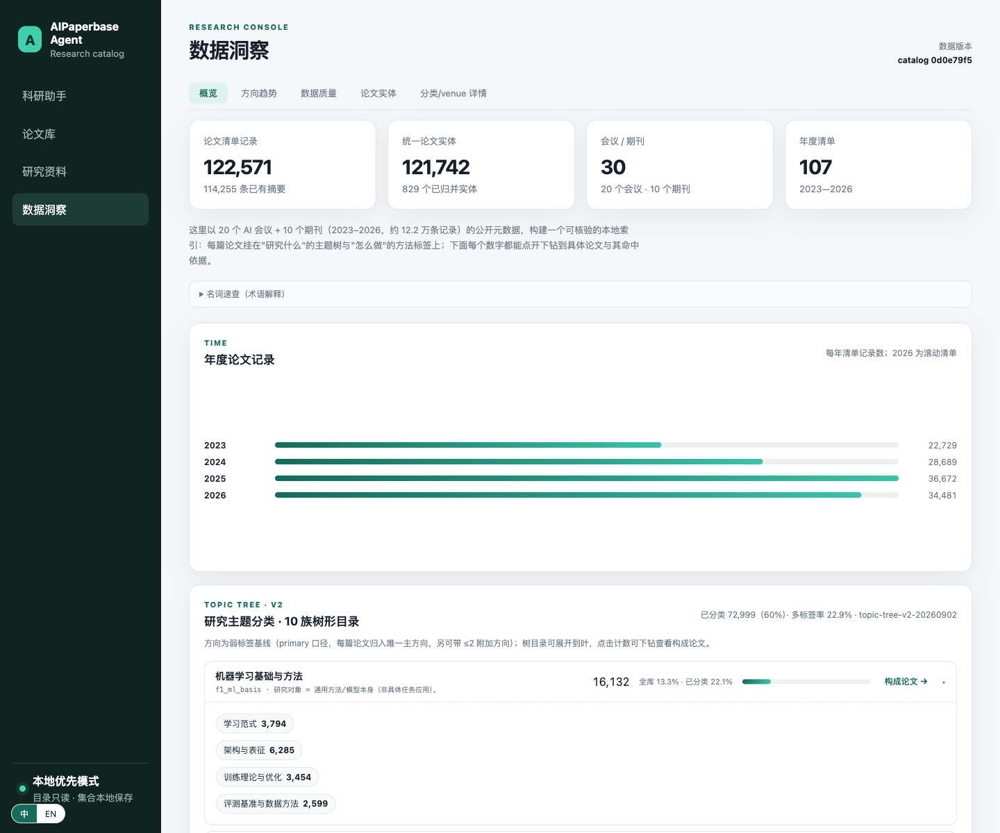

# AIPaperbase Agent

> English: [README.md](./README.md)

> **AIPaperbase Agent** —— 你搭建并研读的 AI 论文库之上，跑着一个 agent。

> **状态：个人项目，持续开发中。** 为个人使用而建，目录控制台已稳定；RAG/Agent 层已端到端可用、仍在演进。按你自己的节奏使用。



## 这是什么、给谁用

**如果你是经常读论文的 AI 方向研究者**，AIPaperbase Agent 让你在本地拥有一个关于你跟踪领域的**可信、可核验的索引**——而不是一堆 PDF 和零散清单。

它把 **AI 顶会顶刊的元数据**变成真正能用的东西：

- **一眼看到领域全貌。** 约 12.2 万条记录（20 会议 + 10 期刊，2023–2026）的按 venue、按方向地图：哪个方向热、在哪个会、逐年怎么变——每个数字都能下钻到可审计的论文清单。
- **精确找到你要的。** 每篇论文挂在**两个永不打架的轴**上：**主题树**（研究*什么*，如"图像超分"、"RAG 与知识增强"）+ **方法标签**（怎么做，`diffusion`、`agentic`、`llm-based`…）。结果带**命中依据**（哪些词/benchmark 触发），不是黑箱打分。
- **维护自己的库。** 建集合、下载 PDF（内容去重）、MinerU 解析成 Markdown——全部本地可复现。
- **问有依据的问题。** 科研问答**只基于你放入的论文**作答，引用可点回原文 PDF/章节；可选的 Agent 工具还能代你查 arXiv / OpenAlex / 网页。

**名字怎么读——*base* 与 *agent*？** *base*（论文库）是你从会议元数据构建的本地索引与文库：目录、集合、下载、解析全文都在里面。*agent*（代理）是跑在这个库上、带引用作答的可选研究协作者。两者都不必齐全才能起步：控制台只靠元数据就能跑。

**一切本地优先**：数据与代码都在你的机器上。唯一外发的只有你主动开启的 API 调用（PDF 解析、向量化、LLM、可选的网页抓取）。

## 它怎么工作（一张图）

```text
venue 年度 CSV（已入库，data/catalog）
   → catalog.sqlite：校验 + 实体去重（arXiv/预印本 ↔ 正式发表）+ 完整性检查
        → 分类：主题树（primary + ≤2 附加叶）+ 方法标签
              → 控制台：主题地图、venue 墙、检索、下钻到论文
然后，对你自己选的论文：
   集合 → PDF 下载（内容去重）→ MinerU 转 Markdown
        → 切块 → Embedding → Qdrant（向量库）
              → 检索 → 重排 → LLM 带引用回答
```

两个词典刻意分开：**主题树**回答"研究什么"，**方法标签**回答"怎么做"——所以一篇"用 Agent 做的超分论文"算超分论文，而不是 Agent 论文。

## 60 秒上手

1. 打开控制台 → **概览**：整个目录一屏总览（主题 × venue × 年份）。
2. 点某主题或 venue → **详情页**：子主题、方法标签构成、年变化、top venue、构成论文。
3. 打开**论文目录** → 检索/筛选 → "查看摘要/来源"与依据单元告诉**为什么**这篇论文在这。
4. 建**集合** → 对集合跑 **下载 → 解析 → 入库**。
5. 问**科研助手**一个问题，回答会引用它用到的本地论文。

## 快速开始

前置：**Python 3.12+**、可选 `.venv`；**仅 RAG 功能**需要 **Docker**（Qdrant）与少量 OpenAI 兼容 API key。

```bash
# 1) 安装
python3 -m venv .venv && source .venv/bin/activate
pip install -r requirements-rag.txt

# 2) 配置（仅 RAG/Agent 功能需要）
cp .env.example .env
#   GENERATOR_*  你的 LLM（OpenAI 兼容 chat，如 DeepSeek / OpenRouter）
#   EMBEDDING_*  用于 RAG 的向量模型（默认 OpenRouter 上 qwen3-embedding）
#   RERANKER_*   用于 RAG 的重排模型（默认 SiliconFlow 上 Qwen3-Reranker）
#   MINERU_TOKEN 只有想解析已下载 PDF 时需要（MinerU）
#   OPENALEX_MAILTO 可选，提高 OpenAlex 科研检索的免费配额

# 3) 启动 Qdrant（仅 RAG —— 向量库）
docker run -d -p 6333:6333 qdrant/qdrant

# 4) 构建只读目录库（元数据控制台不需要 Qdrant、不需要 key）
.venv/bin/python -m backend.catalog.import_csv

# 5) 启动控制台 → http://127.0.0.1:8765
.venv/bin/python -m backend.api.server

# 6) 测试
.venv/bin/python -m unittest discover -s tests -p 'test_*.py'
```

`requirements-catalog.txt` 仅供维护者重采集 venue 元数据使用，安装/运行用不到。

### 用 AI 编程 agent 免手把手上手

把下面整段粘贴给 Claude Code / Cursor 等 coding agent（在仓库根目录运行）：

```text
帮我搭好这个项目并验证能跑起来。
1) python3 -m venv .venv && .venv/bin/pip install -r requirements-rag.txt
2) cp .env.example .env   # 不用 RAG/agent 功能可全部留空
3) 建目录库（仅标准库，无需 Qdrant/key）：
   .venv/bin/python -m backend.catalog.import_csv
4) 起控制台：.venv/bin/python -m backend.api.server → 打开 http://127.0.0.1:8765
5) 跑测试：.venv/bin/python -m unittest discover -s tests -p 'test_*.py'
一律用 .venv/bin/python，不要用系统 python（PEP 668 会拒绝装依赖）。
仅当要用 RAG/agent 功能：起 Qdrant（docker run -d -p 6333:6333 qdrant/qdrant）
并在 .env 里填 EMBEDDING_*/RERANKER_*/GENERATOR_*。
这是个人项目、开发中——任何失败请原样汇报。
```

### 各功能需要什么

| 你想… | 需要 |
|---|---|
| 浏览 / 检索 / 洞察目录 | 第 1、4、5 步即可（只用 Python 标准库） |
| 下载并解析集合 PDF | 联网；解析需要 MinerU token |
| **RAG 带引用问答** | Qdrant 运行 + `EMBEDDING_*`/`GENERATOR_*`/`RERANKER_*` + 已下载解析的论文 |
| 科研 Agent 对话（arXiv / OpenAlex / 网页） | Qdrant + 生成模型 key（OpenAlex 匿名免费） |

进程级 `GENERATOR_TOKEN_BUDGET` 保护你的 API 花费。

## 配置参考

完整 key 列表见 [`.env.example`](./.env.example)。平台均为 OpenAI 兼容，换供应商只改 `base_url` + `api_key` + `model`。

## 仓库结构

| 路径 | 说明 |
|---|---|
| [`backend/`](./backend/README.md) | 模块化 Python 单体：目录导入/实体归并、分析、集合、文库、RAG 胶水层、控制台 HTTP API |
| [`raglib/`](./raglib/) | 可复用、零业务依赖的 RAG 核心（切块→向量→检索→重排→生成） |
| [`frontend/`](./frontend/README.md) | 本地控制台单页（原生 JS、无构建）——**中/EN 切换，默认中文** |
| [`data/catalog/`](./data/catalog/README.md) | 年度 venue 元数据 CSV —— 可重建 catalog 的入库来源 |
| [`config/`](./config/README.md) | `topics.json`（主题树）、`methods.json`（方法标签）、评估脚手架 |
| [`scripts/`](./scripts/README.md) | 维护者工具：采集、摘要补全、校验器 |
| [`tests/`](./tests/README.md) | `unittest` 测试集 |

## 诚实说明

- **目录范围**：20 个 AI 会议 + 10 个期刊，2023–2026（约 12.2 万条记录、去重后约 12.1 万实体）；2026 为滚动清单。元数据来自公开节目页/API——对外重分发衍生数据前请自行核对各来源条款。
- **分类是本地、基于证据的基线**——不是官方学科分类，也不是逐篇人工审核。每条标签可复现、可下钻到命中依据。
- **`topics.json` 主题词表当前为中文**；EN 模式经前端镜像词表显示英文（best-effort）。词表原生英文化是已知 TODO。
- **本地优先**：生成的库、下载、解析全文与个人数据不入库；`data/catalog/` CSV 是例外、也是重建来源。
- 设计与开发文档在 `docs/` 下，不进公开镜像。
